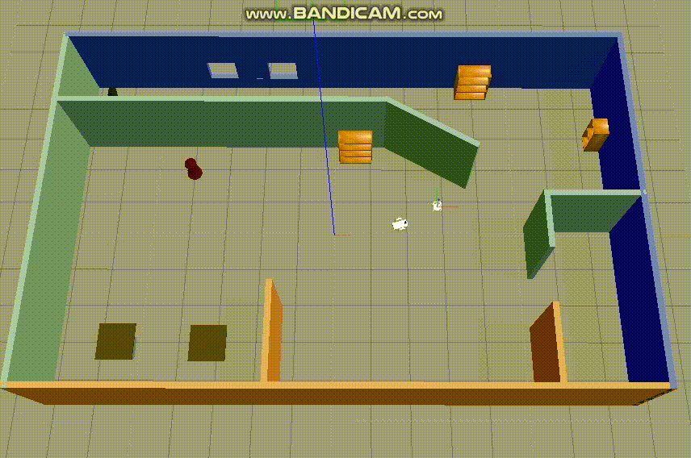

# Go chase it!
We have created the world. Now we are adding an operation to make the robot chase a white ball.

## Before getting started
* Ubuntu-16.04 or 18.04  
* ROS Kinetic or Noetic
* Gazebo-7.x.x or 9.x.x

## Model a white ball
```console
$ gazebo # then Edit-> Model Editor
```
1. Once you have started model editor, insert sphere and place it.
2. Change the radius of sphere to 0.1(both in Visual and Collision).
3. Set its visual Ambient, Diffuse, Specular, and Emissive RGBA values to 1
4. Save the white ball model as my_ball under the /home directory.

## Build and Launch
Once you have installed all the prerequisites, you need to build the packages.
```console
$ cd ~/catkin_ws
$ catkin_make
$ source devel/setup.bash
```
Then you may have build and devel directoiries. Now time to launch. When your world appears on the screen, insert the white ball we have made.
```console
$ roslaunch my_robot world.launch
```
Open a new terminal, then launch ball_chaser package.
```console
$ source devel/setup.bash
$ roslaunch ball_chaser ball_chaser.launch
```

## Result
If the white ball is on the direction that robot is able to recognize, it will start moving. You can check if the operation works well by moving the location of the ball.   
   
